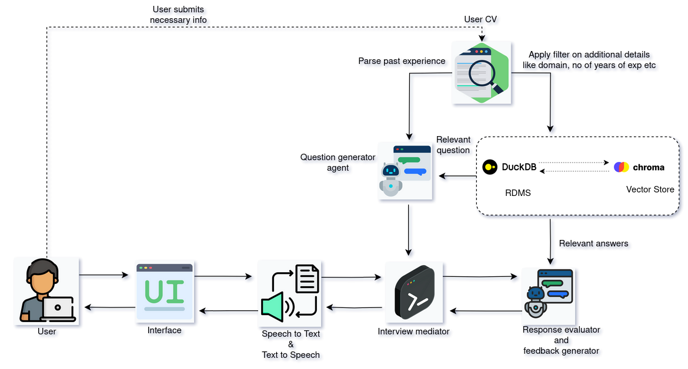

## Architecture

## Below are the instructions on running the task 4 code

### Prerequisite

1. Python is installed with version >= 3.10
2. Pip is installed with version >= 22.0.2
3. Gemini API key is avaialble if not please create using this [link](https://ai.google.dev/)

### Changes that are required before running the script

1. Add your API_KEY in question_generator.py and response_evaluator.py files present under agents directory
2. Change the path (line 6) present in duckdb.py file to point to the dataset directory
3. Change the CHROM_PERSISTENT_PATH (line 7) present in chromadb.py file to the location of chroma persistence

### How to use

1. In main.py file change the company and profile variable accordingly
2. Make sure you have made all the necessary changes mentioned above
3. Run the main.py file and input the user response audio file path whenever asked for user input based on the question.
4. Once all questions are answered a list of dictionary with Question,User Response and Feedback will be generated

### Further improvments

1. main.py file should be modified accordingly to integrate with Streamlit UI
2. Common configuration file can be made to make all the changes at once
3. LLM prompts can be enhanced to provide more detailed evaluation or relevant questions
4. Speech to Text and Text to Speech tasks can be asynchronous as these are consuming considerable amount of time
